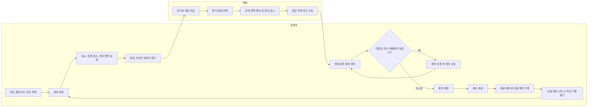
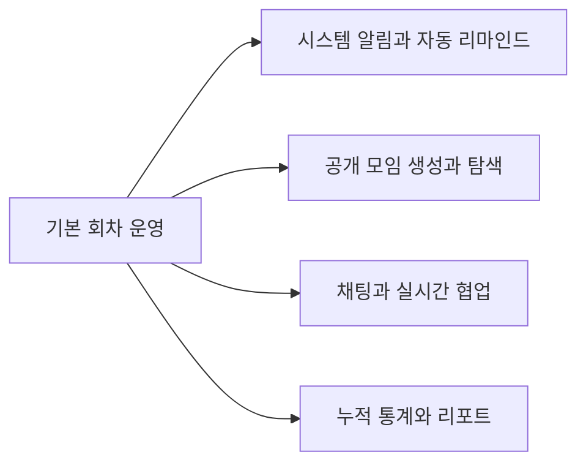

# 반복 모임 운영 서비스, Moimloop

## 0. 문서 목적

Moimloop 프로젝트의 사용자 흐름을 V1 / V2 / V3 기준으로 정리한 문서

## 1. V1 핵심 사용자 흐름

V1의 핵심 루프: `모임 생성 또는 선택 -> 회차 생성 -> 멤버 응답 -> 운영자 확인/확정 -> 회차 종료 -> 다음 액션 기록 -> 다음 회차 시작 시 참고`

### V1 Core Loop Diagram

[V1 상세 유저 플로우](./v1_user_flows.md)

## 2. V2 확장 흐름

V2는 V1 핵심 루프에서 운영자의 반복 업무를 더 줄이는 것을 목적으로 함

### V2 Expansion Diagram

[V2 상세 유저 플로우](./v2_user_flows.md)

## 3. V3 확장 흐름

V3는 서비스의 확장을 목적으로 하며 자동화, 채팅과 실시간 협업, 누적 통계와 리포트 등을 목적으로 한다.

### V3 Expansion Diagram

[V3 상세 유저 플로우](./v3_user_flows.md)