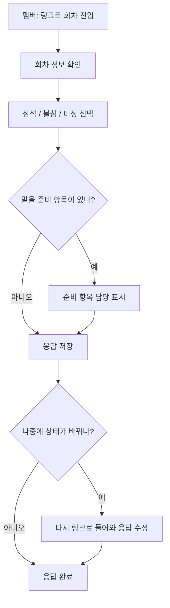
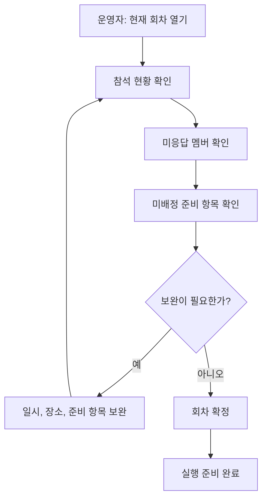

# 반복 모임 운영 서비스, Moimloop

## V1 유저 플로우

### 운영자 흐름

#### Flow V1-A. 운영자가 모임을 만들고 첫 회차를 연다.

**목표**

운영자가 첫 사용 시 모임을 만들고 첫 회차를 열어 멤버 응답 가능한 상태로 열기

**흐름**

1. 운영자는 새 모임을 만든다.
2. 운영자는 모임 이름과 기본 설명을 입력한다.
3. 운영자는 첫 회차를 생성한다.
4. 운영자는 회차의 일시, 확정 장소 또는 진행 방식, 간단한 메모를 입력한다.
5. 운영자는 필요한 준비 항목을 추가한다.
6. 운영자는 회차를 `준비 중` 상태로 저장하고 멤버가 응답할 수 있게 연다.

**결과**

- 운영 대상 모임이 생성된다.
- 첫 회차가 응답 가능한 상태가 된다.

#### Flow V1-B. 운영자가 다음 회차를 생성하고 응답 가능한 상태로 만든다

**목표**

운영자가 현재 스터디의 다음 회차를 빠르게 준비하고, 멤버 응답을 받을 수 있는 상태로 만들기

**흐름**

1. 운영자는 특정 모임의 현재 또는 다음 회차 맥락으로 진입한다.
2. 운영자는 새 회차를 생성한다.
3. 운영자는 회차의 일시와 확정 장소 또는 진행 방식을 입력한다.
4. 운영자는 필요한 준비 항목을 추가하거나 정리한다.
5. 운영자는 회차를 `준비 중` 상태로 저장한다.
6. 운영자는 멤버가 응답할 수 있는 상태로 회차를 연다.

**결과**

- 다음 회차가 생성된다.
- 멤버 응답 수집이 가능한 상태가 된다.

### 멤버 흐름

#### Flow V1-C. 멤버가 링크로 진입해 참석 상태와 준비 항목을 남긴다

**목표**

멤버가 짧은 시간 안에 회차 정보를 확인하고 자신의 참석 상태와 준비 담당 여부를 남

**흐름**

1. 멤버는 링크로 회차에 진입한다.
2. 멤버는 회차의 일시, 확정 장소 또는 진행 방식, 준비 항목을 확인한다.
3. 멤버는 `참석`, `불참`, `미정` 중 하나를 선택한다.
4. 멤버는 맡을 수 있는 준비 항목이 있으면 자신의 담당으로 표시한다.
5. 멤버는 응답을 저장한다.
6. 멤버는 필요할 경우 나중에 다시 들어와 응답을 수정한다.

**결과**

- 운영자는 멤버의 참석 상태를 확인할 수 있다.
- 준비 항목의 담당 상태가 갱신된다.

### 운영자 확인 및 종료 흐름

#### Flow V1-D. 운영자가 현재 회차 상태를 확인하고 확정한다

**목표**

운영자가 현재 회차의 미완료 상태를 한눈에 파악하고, 실행 가능한 상태로 회차를 확정

**흐름**

1. 운영자는 현재 회차 상세를 연다.
2. 운영자는 참석 현황을 확인한다.
3. 운영자는 미응답 멤버를 확인한다.
4. 운영자는 미배정 준비 항목을 확인한다.
5. 운영자는 필요한 정보를 보완하거나 준비 항목을 정리한다.
6. 운영자는 회차 상태를 `확정`으로 변경한다.

**결과**

- 운영자는 이번 회차가 어디까지 준비되었는지 명확히 안다.
- 회차가 실행 가능한 상태로 정리된다.

#### Flow V1-E. 운영자가 회차를 종료하고 다음 액션을 기록한다

**목표**

운영자가 회차를 마무리하면서 지난 회차의 결과를 다음 회차 준비로 이어질 정보로 남김

**흐름**

1. 운영자는 현재 회차를 연다.
2. 운영자는 회차 상태를 `종료`로 변경한다.
3. 운영자는 이번 회차의 짧은 메모를 기록한다.
4. 운영자는 다음 회차에 이어질 액션을 기록한다.
5. 운영자는 회차 종료를 저장한다.

**결과**

- 종료된 회차의 핵심 메모가 남는다.
- 다음 회차 준비에 참고할 액션이 남는다.

### 운영 종료 후 다음 회차로 이어지는 흐름

#### Flow V1-F. 다음 회차를 시작할 때 직전 회차 메모와 다음 액션을 참고한다

**목표**

운영자가 새 회차를 열 때 직전 회차의 맥락을 다시 보고, 준비를 이어서 시작

**흐름**

1. 운영자는 모임의 현재 또는 다음 회차 맥락으로 진입한다.
2. 운영자는 직전 회차 메모와 다음 액션을 확인한다.
3. 운영자는 이어져야 할 준비 항목을 반영한다.
4. 운영자는 새 회차를 생성하거나 준비 중인 회차를 수정한다.
5. 운영자는 다음 회차를 다시 응답 가능한 상태로 연다.

**결과**

- 직전 회차와 다음 회차가 끊기지 않고 이어진다.
- 운영자는 같은 정보를 다시 찾거나 재정리하는 부담을 줄인다.